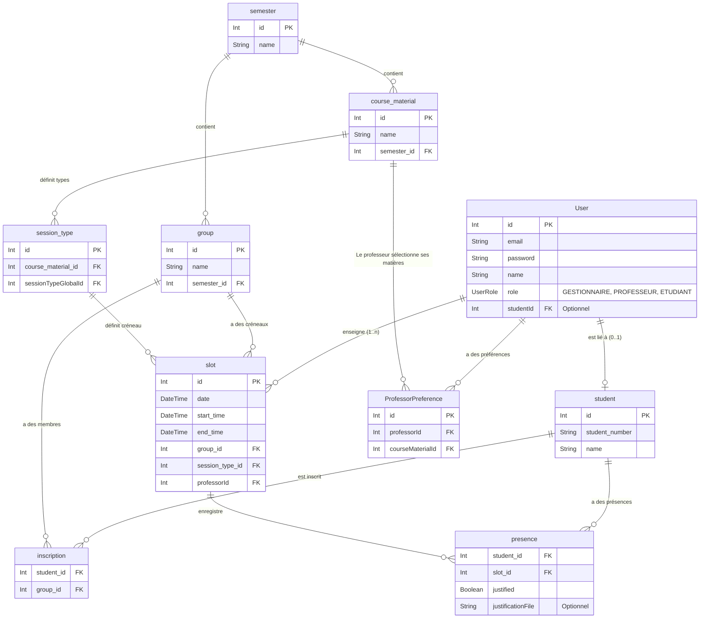

# Schéma de la base de données complet

```mermaid
erDiagram
    User {
        Int id PK
        String email
        String password
        String name
        UserRole role "GESTIONNAIRE, PROFESSEUR, ETUDIANT"
        Int studentId FK "Optionnel"
    }

    student {
        Int id PK
        String student_number
        String name
    }

    inscription {
        Int student_id FK
        Int group_id FK
    }

    group {
        Int id PK
        String name
        Int semester_id FK
    }

    semester {
        Int id PK
        String name
    }

    course_material {
        Int id PK
        String name
        Int semester_id FK
    }

    session_type {
        Int id PK
        Int course_material_id FK
        Int sessionTypeGlobalId FK
    }

    presence {
        Int student_id FK
        Int slot_id FK
        Boolean justified
        String justificationFile "Optionnel"
    }

    slot {
        Int id PK
        DateTime date
        DateTime start_time
        DateTime end_time
        Int group_id FK
        Int session_type_id FK
        Int professorId FK
    }

    ProfessorPreference {
        Int id PK
        Int professorId FK
        Int courseMaterialId FK
    }

    %% Relations
    User ||--o| student : "est lié à (0..1)"
    User ||--o{ slot : "enseigne (1..n)"
    User ||--o{ ProfessorPreference : "a des préférences"
    
    student ||--o{ inscription : "est inscrit"
    student ||--o{ presence : "a des présences"
    
    group ||--o{ inscription : "a des membres"
    group ||--o{ slot : "a des créneaux"
    
    semester ||--o{ group : "contient"
    semester ||--o{ course_material : "contient"
    
    course_material ||--o{ session_type : "définit types"
    course_material ||--o{ ProfessorPreference : "Le professeur sélectionne ses matières"
    
    session_type ||--o{ slot : "définit créneau"
    
    slot ||--o{ presence : "enregistre"
```
